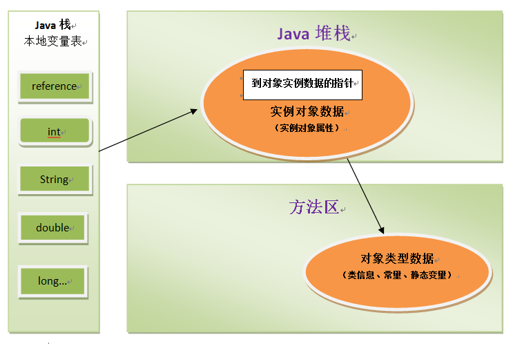

## 一、概述

Java与C++之间有一堵由**内存动态分配**和**垃圾收集技术**所围成的高墙，墙外的人想进去，墙里的人想出来

## 二、运行时数据区域

<!-- more -->

### 程序计数器

- 可以看作是当前线程所执行字节码的**行号指示器**
- Java虚拟机的多线程是通过线程轮流切换并分配处理器执行时间的方式实现的，在任何一个时刻，一个处理器（对于多核处理器来说是一个内核）都只会执行一条线程中的指令，每条线程都需要有一个独立的程序计数器，属于线程私有。

### 虚拟机栈

- 为虚拟机执行Java方法服务，描述的是Java方法执行的**内存模型**，生命周期与线程相同，线程私有。
- 每个方法在执行时都会创建一个**栈帧**，用于存储局部变量表、操作数栈、动态链接、方法出口等信息，方法执行的过程，就对应一个栈帧在虚拟机栈中入栈到出栈的过程。
- 局部变量表存放了编译期可知的各种基本数据类型、reference类型、returnAddress类型，其中64位长度的long和double会占用2个局部变量空间，其余占用1个。局部变量表所需的内存空间在编译期间完成分配，在方法运行期间不会改变表的大小。
- 如果线程请求的栈深度大于虚拟机允许的深度，将抛出**StackOverflowError**

### 本地方法栈

- 为虚拟机使用到的native方法服务
- HotSpot虚拟机直接把本地方法栈和虚拟机栈合二为一
- 也会抛出**StackOverflowError**

### 堆

- 是被所有**线程共享**的一块内存区域，在虚拟机启动时创建
- 虚拟机管理内存最大一块，所有对象实例以及数组都要在堆上分配
- 垃圾回收的主要区域，也被称为gc堆
- 虚拟机按照可扩展来实现堆（通过-Xmx、-Xms），无法扩展时，将会抛出**OutOfMemoryError**

### 方法区

- 用于存储已被虚拟机加载的类信息、常量、静态变量、即时编译的代码，线程共享区域。

### 运行时常量池

- 用于存放编译期生成的各种字面量和符号引用
- 方法区的一部分，当无法申请到内存时将会抛出**OutOfMemoryError**

## 三、直接内存

- 不是虚拟机运行时数据区的一部分，但也被频繁使用（如基于缓冲区的NIO）
- 服务器在配置虚拟机参数时，会根据实际内存设置-Xmx等参数信息，常常忽略直接内存，使得各个内存区域总和大于物理内存的限制，从而出现**OutOfMemoryError**异常

## 四、虚拟机对象

本文用虚拟机HotSpot和常用的内存区域Java堆为例，深入探讨对象分配、布局、访问的全过程。

### 对象的创建

**1、检查**

- 虚拟机遇到一条new指令时，首先检查能否在常量池中定位到一个类的符号引用，并检查类是否已被加载、解析和初始化过。（如果没有，要执行相应的类加载过程）

**2、分配内存**

- **指针碰撞**：Java堆中内存是规整的，用过的内存和空闲的内存中间放着一个指针作为分界点的指示器，分配内存只需要把分界指针向空闲内存移动指定距离即可
- **空闲列表**：Java堆中内存不规整，虚拟机维护一个列表记录空闲和占用的内存区域，分配内存只需要在列表中找到一块够大空间，并更新列表记录即可
- Java堆是否规整又由采用的垃圾收集器是否带有压缩整理功能决定（CMS、G1采用空闲列表，Serial、ParNew采用指针碰撞）

**并发下内存分配**

- 对分配内存空间动作进行同步处理，虚拟机采用CAS配上失败重试的方式保证更新操作的原子性
- 本地线程分配缓冲（TLAB），在线程的TLAB上分配，只有TLAB用完需要重新分配时，才需要同步锁定

**3、初始化**

- 虚拟机将分配到的内存空间都初始化为零值（不包括对象头）
- 保证了对象可以不赋初始值直接使用

**4、设置对象头**

- 类的实例、对象哈希码、对象GC分代年龄等

一般来说，执行new指令之后会接着执行`<init>`方法，按照程序员意愿进行初始化，这样一个真正可用的对象才算产生。

### 对象的内存布局

**1、对象头**

- 第一部分用于存储对象自身运行时数据，如哈希码、GC分代年龄、锁状态标志、偏向线程ID等，官方称它为**Mark Word**
- 另一部分是类型指针，虚拟机通过这个指针来确定这个对象是哪个类的实例，如果对象是一个数组，还必须有一块记录数组长度的数据

**2、实例数据**

- 对象真正存储的有效信息

**3、对齐填充**

- 自动内存管理要求对象的起始地址必须是8字节的整数倍，当对象实例数据部分没有对齐时，就需要通过对齐填充来补全

### 对象的访问定位

程序需要通过栈上的reference数据来操作堆上的具体对象

**1、句柄**

使用句柄来访问的最大好处就是reference中存储的是稳定的句柄地址，在对象被移动时，只会改变句柄中的实例数据指针，而reference本身不需要更改

**2、直接指针**

使用直接指针最大好处就是速度更快，节省了一次指针定位的时间开销

## 扩展阅读

- [Java8废除方法区永久代](https://www.cnblogs.com/yulei126/p/6777323.html )
- [Java直接内存与堆内存](https://www.cnblogs.com/z-sm/p/6235157.html?utm_source=itdadao&amp;utm_medium=referral )

