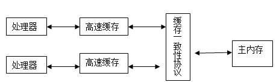

## 一、概述

衡量一个服务性能的高低好坏，每秒事务处理数（TPS）是最重要的指标之一，代表着一秒内服务端平均能响应的请求总数，而TPS值与程序的并发能力又有非常密切的关系

## 二、硬件的效率与一致性

基于高速缓存的存储交互很好地解决了处理器与内存的速度矛盾



**缓存一致性**

在多处理器系统中，每个处理器都有自己的高速缓存，而它们又共享同一主内存，当多个处理器的运算任务都涉及同一主内存区域时，将可能导致各自的缓存数据不一致，为了解决缓存一致性问题，各个处理器访问缓存都要遵循一些协议，如MSI、MESI、MOSI等

<!-- more -->

## 三、Java内存模型

Java内存模型的主要目标是定义程序中各个**变量的访问规则**，即在虚拟机中将变量存储到内存和从内存中取出变量的底层细节

### 1、主内存与工作内存


### 2、内存间交互操作


- **lock（锁定）**：作用于主内存的变量，把一个变量标识为一条线程独占状态
- **unlock（解锁）**：作用于主内存变量，把一个处于锁定状态的变量释放出来，释放后的变量才可以被其他线程锁定
- **read（读取）**：作用于主内存变量，把一个变量值从主内存传输到线程的工作内存中，以便随后的load动作使用
- **load（载入）**：作用于工作内存的变量，它把read操作从主内存中得到的变量值放入工作内存的变量副本中
- **use（使用）**：作用于工作内存的变量，把工作内存中的一个变量值传递给执行引擎，每当虚拟机遇到一个需要使用变量值的字节码指令时将会执行这个操作
- **assign（赋值）**：作用于工作内存的变量，它把一个从执行引擎接收到的值赋值给工作内存的变量，每当虚拟机遇到一个给变量赋值的字节码指令时执行这个操作
- **store（存储）**：作用于工作内存的变量，把工作内存中的一个变量的值传送到主内存中，以便随后的write的操作
- **write（写入）**：作用于主内存的变量，它把store操作从工作内存中一个变量的值传送到主内存的变量中

**虚拟机实现上述提及的每一种操作都是原子的、不可再分的**

### 3、volatile变量的特殊规则

关键字volatile可以说是Java虚拟机提供的最轻量级的同步机制

#### 3.1 可见性之变量同步

当一个变量定义为volatile后，一条线程修改了这个变量的值，新值对于其他线程来说是立即得知的

```java
public class VolatileTest {
    public static volatile int race=0;
    public static void increase(){
        race++;
    }
    public static void main(String[] args) throws InterruptedException {
        Thread[] threads=new Thread[20];
        for(int i=0;i<20;i++){
            threads[i]=new Thread(new Runnable() {
                @Override
                public void run() {
                    for(int j=0;j<10000;j++){
                        increase();
                    }
                }
            });
            threads[i].start();
        }
        //等待所有累加线程结束
        //为什么是2？多了个monitor ctrlbreak线程
        while (Thread.activeCount()>2){
            Thread.yield();
        }
        System.out.println(race);
    }
}
```

每次运行程序，输出的结果都不一样，都是一个小于200000的数字，为什么呢？

```java
public static void increase();
    descriptor: ()V
    flags: ACC_PUBLIC, ACC_STATIC
    Code:
      stack=2, locals=0, args_size=0
         0: getstatic     #2                  // Field race:I
         3: iconst_1
         4: iadd
         5: putstatic     #2                  // Field race:I
         8: return
      LineNumberTable:
        line 6: 0
        line 7: 8
```

问题就出现在自增运算race++上，从字节码层面上很容易分析出并发失败的原因了，当getstatic指令把race的值取到操作数栈顶时，volatile保证了race的值此时是正确的，但是在执行iconst_1、iadd指令的时候，其他的线程已经改变了race的值，而在操作数栈的值就变成了过期的数据，所以putstatic指令执行后就可能把较小的race值同步回主内存之中

由于volatile变量只能保持**可见性**，在不符合以下场景中，我们仍然要通过加锁来保证**原子性**：

- **当前无关依赖**：运算结果不依赖变量当前值
- **单一线程修改**：只有单一线程修改变量

#### 3.2 禁止指令重排序优化

**定义**

指令重排序是指CPU采用允许将多条指令不按程序规定顺序分开发送给各相应电路单元处理，CPU需要能正确处理指令依赖情况以保障程序能得出正确的执行结果。

譬如指令1把地址A中的值加10，指令2把地址A中的值乘以2，指令3把地址B中的值减去3，这时指令1和指令2是存在依赖关系的，它们之间的顺序不能重排，但指令3可以排到指令1、2之前或者中间，只要保证CPU执行后面依赖到A、B值的操作时能获取到正确的A和B值即可

**例子**

```java
//模拟指令重排序，实际概率太小
class ReorderExample {  
    int a = 0;  
    boolean volatile flag = false;//volatile去掉  

    public void writer() {  
        a = 1;          // 1   
        flag = true;    // 2   
    }  

    public void reader() {  
        if (flag) {            // 3   
            int i = a * a; // 4  
            System.out.println(i);
        }  
    }  
} 
public static void main(String[] args){
    ReorderExample re=new ReorderExample();
     //thread A
    new Thread(new Runnable() {
        @Override
        public void run() {
            re.writer();
        }
    }).start();
    //thread B
    new Thread(new Runnable() {
        @Override
        public void run() {
            re.reader();
        }
    }).start();
}
```

如果发生指令重排序，线程A标记的第2行先于第1行执行，那么线程B中的 i 值计算就会出现错误

**原理**

volatile修饰的变量，赋值后多执行一个lock，形成内存屏障，利用lock把lock前面的“整体”锁住，当前面的完成了之后lock后面“整体”的才能完成，当写完成后，释放锁，把缓存刷新到主内存

这里的前后指的是程序代码中的顺序，不是字节码指令的顺序

**总结**

volatile变量的读操作性能与普通变量没什么区别，但是写操作可能慢一些，因为需要在本地代码中插入许多内存屏障指令保证处理器不乱序执行，大多数情景下volatile总开销要比锁低，volatile与锁之间选择的唯一依据仅仅是volatile语义能否满足使用场景的需求

### 4、long与double变量的特殊规则

**非原子性协定**

允许虚拟机将没有被volatile修饰的64位数据的读写操作划分为两次32位的操作进行

在实际开发中，选择把64位数据读写操作作为原子操作来对待，不需要指定volatile修饰，由虚拟机底层支持

### 5、原子性、可见性、有序性

**原子性**

- 指操作不能再分，是一个完整的整体

- 基本数据类型的访问读写是具备原子性的

- synchronized块之间的操作也具备原子性

**可见性**

- 指一个线程修改了可见变量的值，其他线程立即得知
- volatile、synchronized、final

**有序性**

- 本线程内观察，所有操作都是有序的（线程内表现为串行）
- 线程外观察，所有操作都是无序的（指令重排序、工作内存与主内存同步延迟）
- volatile、synchronized

### 6、先行发生原则

先行发生是Java内存模型中定义的两项操作之间的偏序关系

- **程序次序规则**：在一个线程内，书写在前面的代码先行发生于后面的。确切地说应该是，按照程序的控制流顺序，因为存在一些分支结构。

- **Volatile变量规则**：对一个volatile修饰的变量，对他的写操作先行发生于读操作（先写回主内存再读取）

- **线程启动规则**：Thread对象的start()方法先行发生于此线程的每一个动作

- **线程终止规则**：线程的所有操作都先行发生于对此线程的终止检测

- **线程中断规则**：对线程interrupt()方法的调用先行发生于被中断线程的代码所检测到的中断事件

- **对象终止规则**：一个对象的初始化完成（构造函数之行结束）先行发生于发的finilize()方法的开始

- **传递性**：A先行发生B，B先行发生C，那么，A先行发生C

- **管程锁定规则**：一个unlock操作先行发生于后面对同一个锁的lock操作。

时间先后顺序与先行发生原则之间基本没有太大的关系，所以我们衡量并发安全问题的时候不要受到时间顺序的干扰，一切必须以先行发生原则为准

## 四、Java与线程

线程是比进程更轻量级的调度执行单位，是CPU调度的基本单位

### 1、线程的实现

- 使用内核线程实现
- 使用用户线程实现
- 使用用户线程+轻量级进程（LWP）混合实现

**Java线程的实现**

一条Java线程就映射到一条轻量级线程之中，因为Windows和Linux系统提供的线程模型就是一对一的

### 2、Java线程调度

#### 2.1 协同式线程调度

线程的执行时间由线程本身来控制，线程把自己的工作执行完了以后，要主动通知系统切换到另外一个线程上

#### 2.2 抢占式线程调度

每个线程将由系统来分配执行时间，线程的切换由操作系统来决定

Java线程调度使用的就是抢占式调度，一共设置10个级别的线程优先级，优先级越高的线程越容易被系统选择执行

#### 2.3 优先级推进器

当系统发现一个线程执行得特别“勤奋努力”的话，可能越过线程优先级去为它分配执行时间，因此设置优先级并不是完全准确的，操作系统执行时有一定规则

### 3、状态转换


## 扩展阅读

- [指令重排序](https://www.cnblogs.com/gtaxmjld/p/5274779.html)
- [Thread.activeCount()问题](https://blog.csdn.net/ke_g3/article/details/80199209)


