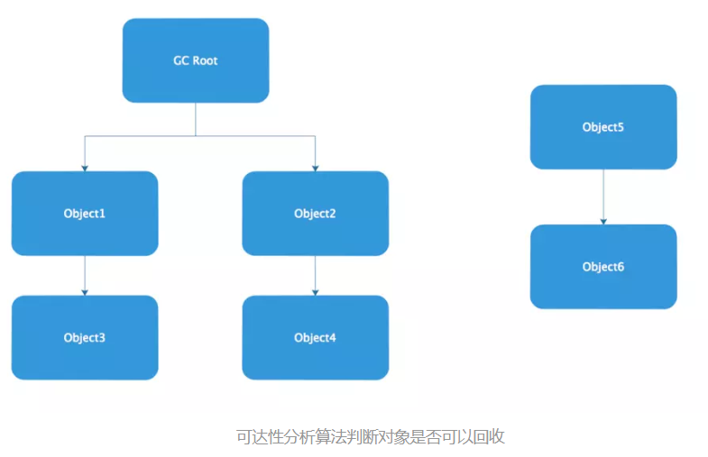
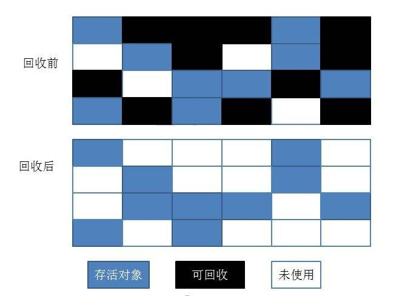
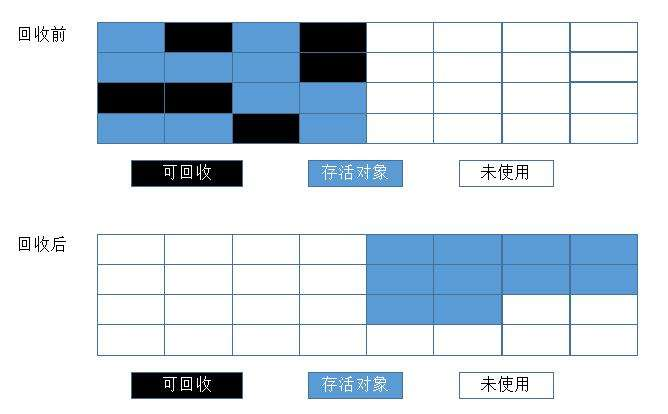
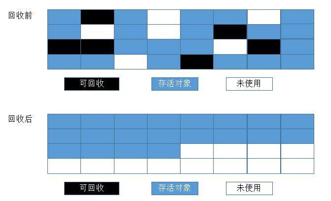
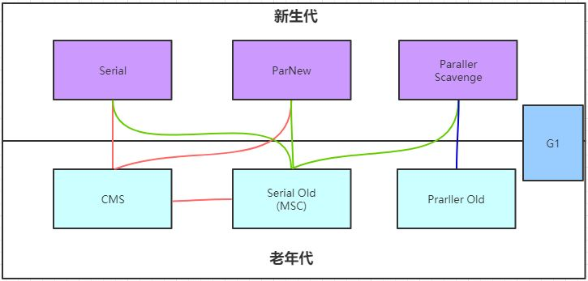
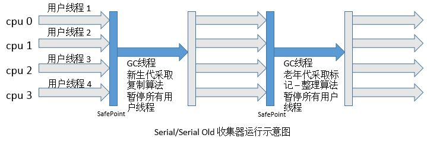
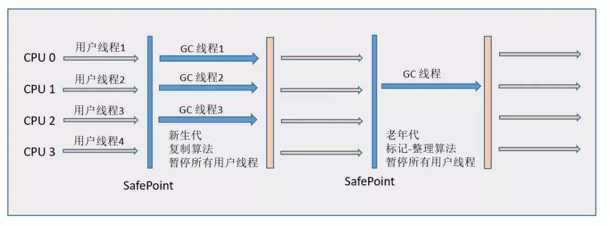
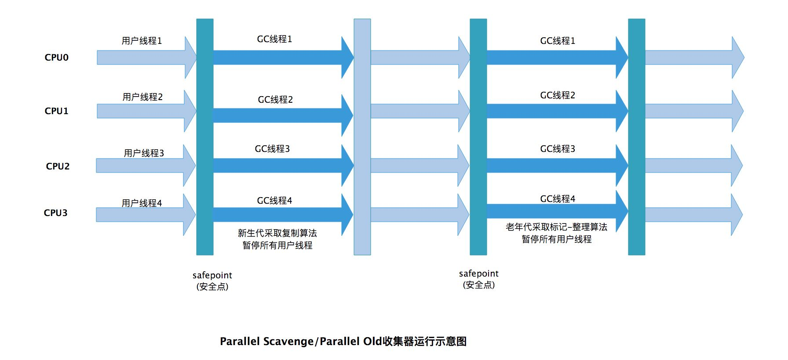
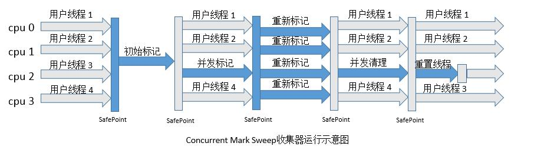
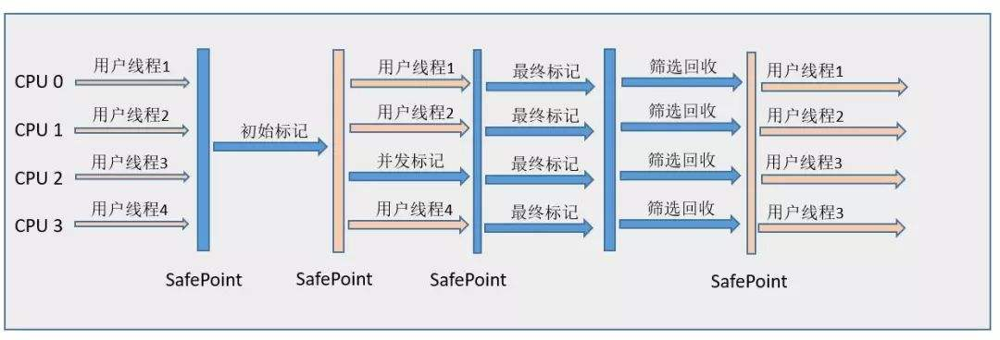

## 一、概述

程序计数器、虚拟机栈、本地方法栈3个区域随线程而生，线程而灭，内存分配和回收都具备确定性

堆与方法区是线程共享区域，内存分配和回收都具备动态性，因此垃圾收集器关注的是这两个区域

**GC需要完成的三件事情**

- **what**：哪些内存需要回收？
- **when**：什么时候回收？
- **how**：如何回收？

<!-- more -->

## 二、对象死亡

解决内容：哪些内存需要回收？

### 引用计数法

给对象添加一个引用计数器，初始为1，每当被引用时，计数器加1，当引用失效时，计数器减1，任何时刻计数器为0的对象就是不可再被使用的。

但是，主流的虚拟机没有采用引用计数法来管理内存，主要原因是很难解决对象之间**循环引用**问题。

### 可达性分析算法

通过一系列GC Roots对象作为起始点向下搜索，走过的路径称为引用链，当一个对象到GC Roots对象没有任何引用链相连时（即图上对象不可到达），则证明对象是不可用的。



**可作为GC Roots对象**

- 虚拟机栈中引用的对象
- 方法区中类静态属性引用的对象
- 方法区中常量引用的对象
- 本地方法栈中引用的对象

### 最终判定

如果对象在进行可达性分析后发现没有与GC Roots对象相连接的引用链，它将等待标记进行回收

**第一次标记**

- 当对象没有覆盖finalize方法，或者finalize方法已经被虚拟机调用过，虚拟机视为没有必要执行
- 如果对象被判定有必要执行finalize方法，对象将会被放置一个F-Queue队列之中，并在稍后由一个虚拟机自动建立的、低优先级的Finalizer线程去执行它

**第二次标记**

- GC对F-Queue中的对象进行第二次小规模的标记，如果对象重新与引用链上的任何一个对象建立关联（例如将自身赋值给某个变量），便会成功拯救自己，避免被回收的命运（**逃逸**）

```java
public class FinalizeEscapeGC {
    public static FinalizeEscapeGC SAVE_HOOK = null;
    @Override
    protected void finalize() throws Throwable {
        super.finalize();
        System.out.println("finalize method executed");
        FinalizeEscapeGC.SAVE_HOOK = this;
    }
    public static void helpGC() throws Throwable {
        SAVE_HOOK = null;
        System.gc();
        Thread.sleep(500);
        if (SAVE_HOOK != null) {
            System.out.println("yes, i am still alive.");
        } else {
            System.out.println("no, i am dead.");
        }
    }

    public static void main(String[] args) throws Throwable {
        SAVE_HOOK = new FinalizeEscapeGC();
        helpGC(); // 第一次执行了finalize自救
        helpGC(); // finalize执行过了一次便不再执行了
    }
}
```

```java
finalize method executed
yes, i am still alive.
no, i am dead.
```

### 对象引用

**强引用**

- 强引用就是指在程序代码中普遍存在的，类似`Object obj = new Object()`这类似的引用，只要强引用在，垃圾收集器永远不会收集被引用的对象

**软引用**

- 软引用用来描述一些有用但非必需的对象，在系统将要发生内存溢出异常之前，将会把这些对象进行回收，如果仍没有足够的内存，才会抛出OutOfMemoryError异常

**弱引用**

- 弱引用用来描述非必需的对象，被弱引用关联的对象只能生存到下一次垃圾收集之前，当垃圾收集器工作时，不管内存是否足够，都会回收掉弱引用对象

**虚引用**

- 最弱的引用，为对象设置虚引用关联的唯一目的就是让对象被回收时收到一个系统通知

### 回收方法区

Java虚拟机规范中不要求虚拟机在方法区实现垃圾收集，因为性价比一般较低

永久代的垃圾收集主要回收两部分内容：废弃常量和无用的类

**废弃常量**

- 常量池中字面量没有任何对象引用，就会被系统清理出常量池

**无用的类**

- 类的所有实例被回收（堆中不存在该类的任何实例）
- 类的ClassLoader被回收
- 类的class对象不被引用（指反射）

## 三、回收时间

解决内容：什么时候回收？

### 枚举根节点

枚举根节点是必须要停顿的，因为分析工作必须在一个能确保一致性的快照中进行（一致性指系统被冻结在某个时间点上，称为”stop the world“）

目前虚拟机使用的是准确式gc，并不需要一个不漏的检查完所有执行上下文和全局引用的位置，在HotSpot中使用一组称为OopMap的数据结构来达到这个目的，在类加载完成的时候，就把对象内什么偏移量上是什么类型数据计算出来，在JIT编译过程中，也会在特定位置（安全点）记录下栈和寄存器中哪些位置是引用

### 安全点

程序执行时并非在所有地方都能停顿下来开始GC，只有到达安全点时才能暂停，安全点太少，GC等待时间太长，安全点太多，增加运行时的负荷。

**产生位置**

- 方法调用
- 循环跳转
- 异常跳转

如何让所有线程在发生GC时都跑到最近安全点上停顿下来？

**抢先式中断**

- 发生GC时，所有线程中断，如果有线程不在安全点上，就恢复线程跑到安全点上

**主动式中断**

- 发生GC时，设置一个GC中断标志，各个线程执行时主动去轮询，发现中断标志为真就自动中断挂起
- 中断标志的地方和安全点是重合的

### 安全区域

安全区域是指在一段代码片段之中，引用关系不会发生变化。

任意地方开始GC都是安全的，可以看作被扩展了的安全点

在线程执行到Safe Region中的代码时，首先标识自己已经进入了Safe Region，那样，当在这段时间里JVM要发起GC时，就不用管标识自己为Safe Region状态的线程了。在线程要离开Safe Region时，它要检查系统是否已经完成了根节点枚举（或者是整个GC过程），如果完成了，那线程就继续执行，否则它就必须等待直到收到可以安全离开Safe Region的信号为止。 

## 四、垃圾收集算法

解决内容：如何回收？

### 标记-清除算法

首先标记出所有需要回收的对象，标记完成后统一回收



效率问题：标记和清除两个过程的效率都不高

空间问题：产生大量不连续的内存碎片

### 复制算法

将可用内存分为大小相等的两块A、B，每次使用A，当A用完后，将A中存活的对象复制到B中，再把A清除



效率问题有了进一步的解决，但可使用内存缩小一半，代价太高

虚拟机采用这种算法回收新生代，将内存分为一块Eden和两块Survivor空间（默认配置8：1：1），每次使用一块Eden和一块Survivor，发生GC时，将Eden和一块Survivor中存活的对象一次性复制到另一块Survivor空间上，最后清除Eden和一块Survivor。

内存的分配担保也一样，如果另一块Survivor空间没有足够空间存放上一次新生代收集下来的存活对象时，这些对象将会直接通过分配担保机制进入老年代。

### 标记-整理算法

标记所有回收的对象，让存活的对象都向一端移动，然后清除掉端边界以外的内存



### 分代收集算法

当前虚拟机采用分代收集算法，把堆分为新生代和老年代，新生代每次都有大批对象死去，少量存活，采用复制算法，而老年代对象存活率高，没有额外空间进行分配担保，采用标记-清除，标记-整理算法进行回收

## 五、垃圾收集器

解决内容：垃圾回收全过程



### Serial/Serial Old收集器

原理：



特性：

- 单线程收集器
- 必须暂停其他所有工作线程，直到它收集结束
- 简单高效，没有线程交互的开销

场景：

- 运行在Client模式下的虚拟机

### ParNew收集器

原理：



特性：

- 就是Serial多线程版本

场景：

- 运行在Server模式下的虚拟机中首选的新生代收集器
- 除Serial外，只有它能与CMS收集器配合工作

### Parallel Scavenge/Parallel Old收集器

原理：



特性：

- 吞吐量优先收集器
- 自适应调节策略

场景：

- 适合在后台运算而不需要太多交互的任务
- 注重吞吐量及CPU资源敏感场合

### CMS收集器



CMS收集器是一种以获取**最短回收停顿时间**为目标的收集器，尤其重视服务的响应速度，希望系统停顿时间最短，以给用户带来较好的体验，目前应用在很大一部分B/S系统**服务端**。

CMS收集器基于标记-清除算法实现，过程分为4个步骤：

- 初始标记：需要短暂停顿，标记一下GC Roots能**直接**关联到的对象
- 并发标记：进行GC Roots Tracing的过程
- 重新标记：需要短暂停顿，修正并发标记期间产生变动的一部分对象
- 并发清除：进行对象回收

从总体上说，初始标记、重新标记要短暂停顿，并发标记、并发清除耗时较长，可以看作内存回收过程是与用户线程一起并发执行的，也被称为并发低停顿收集器。

**明显的缺点**

- 对CPU资源非常敏感（并发标记、并发清除）
- 无法处理浮动垃圾（并发清除过程中，用户线程还会产生垃圾，可能会触发下一次GC）
- 空间碎片问题（基于标记-清除算法）

### G1收集器



G1是一款面向服务端应用的垃圾收集器，具备如下特点：

- 并行与并发：能充分利用多CPU、多核环境下的硬件优势（并发标记）
- 分代收集
- 空间整合：基于标记-整理算法实现
- 可预测停顿：几乎具备实时垃圾收集器的特征（基于优先列表）

**可预测停顿原理**

将整个堆分为多个大小相等独立区域（Region），G1跟踪各个Region里面的垃圾堆积的价值大小（回收获得空间大小、回收所需时间）在后台维护一个优先列表，每次根据允许的收集时间，优先回收价值最大的Region，保证了尽可能高的收集效率。

**避免全堆扫描**

在G1收集器中，Region之间的对象引用以及其他收集器中的新生代与老年代之间的对象引用，虚拟机都是使用Remembered Set来避免全堆扫描的。G1中每个Region都有一个对应的Remembered Set，发现程序在对Reference类型数据进行写操作时，会产生一个Write Barrier暂时中断写操作，检查Reference引用的对象是否处于不同的Region之中，如果是，便通过CardTable把相关引用信息记录到被引用对象所属的Region的Remembered Set之中。当发生GC时，在GC根节点的枚举范围中加入Remembered Set即可保证不对全堆扫描也不会遗漏。

G1基于标记-整理算法实现，过程分为4个步骤：

- 初始标记
- 并发标记
- 最终标记
- 筛选回收

各过程与CMS大体相同

## 六、内存分配与回收策略

### 对象优先在Eden分配

当Eden区没有足够空间进行分配时，虚拟机将发起一次Minor GC

Minor GC：新生代GC

Full GC：老年代GC

### 大对象直接进入老年代

虚拟机提供了一个-XX:PretenureSizeThreshold参数，令大于设置值的对象直接在老年代分配

### 长期存活的对象进入老年代

对象晋升老年代的年龄阈值，可以通过参数-XX:MaxTenuringThreshold设置，默认为15岁

虚拟机给每个对象定义一个对象年龄计数器，如果对象在Eden出生并经过第一次Minor GC后仍然存活，并且能被Survivor容纳的话，将被移动到Survivor空间中，并且对象年龄设为1。对象在Survivor区每熬过一次Minor GC，年龄就增加一岁。

### 动态年龄判定

如果Survivor空间中相同年龄所有对象大小总和大于Survivor空间的一半，年龄大于或等于该年龄的对象就可以直接进入老年代，无须等到MaxTenuringThreshold要求的年龄。

### 空间分配担保

当发生Minor GC时，JVM会首先检查老年代最大的可用连续空间是否大于新生代所有对象的总和，如果大于，那么这次Minor GC是安全的，如果不大于的话，JVM就需要判断HandlePromotionFailure是否允许空间分配担保。 如果允许，JVM继续检查老年代最大的可用连续空间是否大于历次晋升到老年代的对象的平均大小，如果大于，则正常进行一次Minor GC，尽管有风险（因为判断的是平均大小，有可能这次的晋升对象比平均值大很多）；如果小于，或者HandlePromotionFailure设置不允许空间分配担保，这时要进行一次Full GC。

## 扩展阅读

- [通过例子了解Java中的引用](https://www.jianshu.com/p/e5364c05cc80)
- [详解G1垃圾收集器](https://blog.csdn.net/coderlius/article/details/79272773)
- [设置JVM垃圾收集器](https://blog.csdn.net/shi2huang/article/details/80085193)

