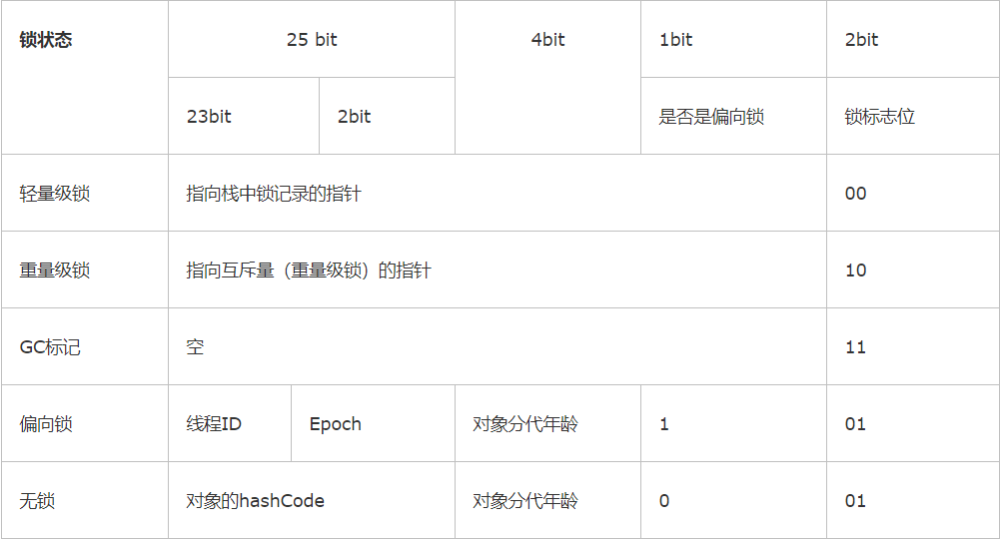

## 一、概述

良好的设计规则不得不向现实做出一些让步，我们必须让程序在计算机中正确无误地运行，然后再考虑如何将代码组织的更好，让程序运行的更快。

对于高效并发，首先需要保证并发的正确性，然后在此基础上实现高效

## 二、线程安全

当多个线程访问操作一个对象时都可以获取正确的结果，那这个对象是线程安全的

<!-- more -->

### 1、Java中的线程安全

#### 1.1 不可变

不可变的对象一定是线程安全的，带来的安全性是最简单和最纯粹的

```java
public final class String
    implements java.io.Serializable, Comparable<String>, CharSequence {
    //采用final修饰，一经初始化就不可变
    private final char value[];
```

#### 1.2 绝对线程安全

不管运行时环境如何，调用者都不需要任何额外的同步措施

Java API中标注线程安全的类，大多数都不是绝对线程安全的

**对vector线程安全的测试**

```java
public class VectorTest {
    private static Vector<Integer> vector = new Vector<>();

    public static void main(String[] args) {
        while (true) {
            for (int i = 0; i < 10; i++) {
                vector.add(i);
            }
            new Thread(new Runnable() {
                @Override
                public void run() {
                    for (int i = 0; i < vector.size(); i++) {
                        //并发下出现越界异常
                        //当vector还有1个元素时，线程A进入循环内部，准备执行删除操作，线程B先将元素删除，线程A没有数据可删除，抛出异常
                        vector.remove(i);
                    }
                }
            }).start();
        }
    }
}
```

```java
Exception in thread "Thread-2399" java.lang.ArrayIndexOutOfBoundsException: Array index out of range: 14
    at java.util.Vector.remove(Vector.java:834)
    at threadsafe.VectorTest$1.run(VectorTest.java:17)
    at java.lang.Thread.run(Thread.java:748)
```

```java
//解决方法，同步对象
synchronized (vector) {
    for (int i = 0; i < vector.size(); i++) {
        vector.remove(i);
    }
}
```

#### 1.3 相对线程安全

我们通常意义上讲的线程安全，Java中大部分线程安全类都属于此类型

如vector、hashtable、CopyOnWriteArrayList、ConcurrentHashMap

#### 1.4 线程兼容

对象本身不是线程安全的，但是可以通过在调用端正确地使用同步手段来保证对象在并发环境中可以安全地使用

如ArrayList、HashMap

#### 1.5 线程对立

调用端无论是否采取同步措施，都无法并发使用

如Thread类的suspend和resume方法，一个尝试中断线程，一个尝试恢复线程，存在死锁风险

### 2、线程安全的实现方法

#### 2.1 互斥同步

**synchronized关键字**

由jvm实现，在执行monitorenter指令时，首先要尝试获取对象的锁，如果对象没被锁定或者当前线程拥有对象的锁，就把锁的计数器加1，在执行monitorexit指令时会将锁计数器减1，当计数器为0时，锁就被释放。如果获取对象锁失败，那当前线程就要阻塞等待，直到对象锁被另外一个线程释放为止

synchronized是一个重量级锁，在必要情况下才去使用

**ReentrantLock重入锁**

由jdk实现，原理同synchronized

相比synchronized，ReentrantLock增加了一些高级功能：

- **等待可中断**：当持有锁的线程长期不释放锁的时候，等待的线程可以选择放弃等待
- **公平锁**：线程按照申请锁的时间顺序来依次获得锁（ReentrantLock默认是非公平的，但可以设置）
- **绑定多个条件**：可以同时绑定多个Condition对象

**总结**

synchronized能实现需求的情况下，优先考虑使用（毕竟是jvm原生的，一直在被优化）

#### 2.2 非阻塞同步

互斥同步，也称阻塞同步，是一种悲观并发策略

非阻塞同步，基于冲突检测的乐观并发策略，不需要把线程挂起

CAS需要3个操作数，V代表当前值，A代表预期值，B代表新值，是一个原子操作

JUC包下的整数原子类使用了Unsafe类的CAS操作

JUC包提供一个带有标记的原子引用类**AtomicStampedReference**通过控制变量值的**版本**来保证CAS的正确性，解决了ABA的问题

#### 2.3 无同步方案

**可重入代码**

在代码执行的任何时刻中断它，转而执行另外一段代码，控制权返回后，原来的程序不会出现任何错误

```java
public boolean fun(){
    //do something
    return true;
}
```

**线程本地存储**

- 把共享数据的可见范围限制在同一个线程之中，无需同步也能保证线程之间不出现数据争用的问题

- 每一个Thread对象都有一个ThreadLocal.ThreadLocalMap对象，存储了一组以ThreadLocal.threadLocalHashCode为键，以本地线程变量为值的K-V值对，ThreadLocal对象就是当前线程的ThreadLocalMap的访问入口，封装一些针对ThreadLocalMap的操作

## 三、锁优化

锁的状态总共有四种：无锁状态、偏向锁、轻量级锁和重量级锁

### 1、自旋锁

**背景**

互斥同步时，共享数据的锁定状态只会持续很短的一段时间，为了这段时间去挂起和恢复线程并不值得

**原理**

为了让线程等待，我们只需让线程执行一个忙循环（自旋）

**问题**

如果锁被占用的时间很短，自旋等待的效果就会非常好，如果锁被占用时间很长，自旋的线程只会白白消耗处理器资源

**自适应自旋**

自旋次数默认值是10次，自适应自旋时间不再固定，由前一次在上一个锁上的自旋时间及锁的拥有者的状态确定

### 2、锁消除

**定义**

消除不可能存在共享数据竞争的锁

**举例**

```java
public synchronized String concat(String s1,String s2){
    return s1+s2;
}
```

```java
//Javac转化后的操作
public String concat(String s1,String s2){
    StringBuffer sb=new StringBuffer();
    sb.append(s1);
    sb.append(s2);
    return sb.toString();
}
```

### 3、锁粗化/锁细化

**定义**

锁粗化：虚拟机探测到有一串零碎的操作都对同一个对象加锁，将会把锁同步的范围扩展到操作的外部

**举例**

```java
//范围扩大整个append操作
StringBuffer sb=new StringBuffer();
sb.append(s1);
sb.append(s2);
```

锁细化：将同步块的作用范围尽量变小，只在共享数据的实际作用域中才进行同步

```java
ConcurrentHashMap采用分段锁实现同步
```

### 4、轻量级锁

轻量级锁并不是代替重量级锁的，**减少**传统重量级锁使用操作系统互斥量产生的性能消耗

重量级锁：互斥量

轻量级锁：CAS操作

**对象头Mark Word**



**加锁过程**

1）在代码进入同步块的时候，如果同步对象锁状态为无锁状态（锁标志位为“01”状态，是否为偏向锁为“0”），虚拟机首先将在当前线程的栈帧中建立一个名为锁记录（Lock Record）的空间，用于存储锁对象目前的Mark Word的拷贝，这时候线程堆栈与对象头的状态如图所示


2）拷贝对象头中的Mark Word复制到锁记录中

3）拷贝成功后，虚拟机将使用CAS操作尝试将对象的Mark Word更新为指向Lock Record的指针，并将Lock record里的owner指针指向object mark word。如果更新成功，则执行步骤（4），否则执行步骤（5）

4）如果这个更新动作成功了，那么这个线程就拥有了该对象的锁，并且对象Mark Word的锁标志位设置为“00”，即表示此对象处于轻量级锁定状态，这时候线程堆栈与对象头的状态如图所示


5）如果这个更新操作失败了，虚拟机首先会检查对象的Mark Word是否指向当前线程的栈帧，如果是就说明当前线程已经拥有了这个对象的锁，那就可以直接进入同步块继续执行。否则说明多个线程竞争锁，轻量级锁就要膨胀为重量级锁，锁标志的状态值变为“10”，Mark Word中存储的就是指向重量级锁（互斥量）的指针，后面等待锁的线程也要进入阻塞状态，而当前线程便尝试使用自旋来获取锁，

**解锁过程**

1）通过CAS操作尝试把线程中复制的Displaced Mark Word对象替换当前的Mark Word。

2）如果替换成功，整个同步过程就完成了。

3）如果替换失败，说明有其他线程尝试过获取该锁（此时锁已膨胀），那就要在释放锁的同时，唤醒被挂起的线程

### 5、偏向锁

**消除**数据在**无竞争**情况下的同步原语，进一步提高程序的运行性能

整个同步都消除掉，连CAS都不做

**加锁过程**

1）访问Mark Word中偏向锁的标识是否设置成1，锁标志位是否为01——确认为可偏向状态。

2）如果为可偏向状态，则测试线程ID是否指向当前线程，如果是，进入步骤（5），否则进入步骤（3）。

3）如果线程ID并未指向当前线程，则通过CAS操作竞争锁。如果竞争成功，则将Mark Word中线程ID设置为当前线程ID，然后执行（5）；如果竞争失败，执行（4）。

4）如果CAS获取偏向锁失败，则表示有竞争。当到达全局安全点（safepoint）时获得偏向锁的线程被挂起，偏向锁升级为轻量级锁，然后被阻塞在安全点的线程继续往下执行同步代码。

5）执行同步代码

**释放锁过程**

偏向锁只有遇到其他线程尝试竞争偏向锁时，持有偏向锁的线程才会释放锁，线程不会主动去释放偏向锁。偏向锁的撤销，会首先暂停拥有偏向锁的线程，判断锁对象是否处于被锁定状态，撤销偏向锁后恢复到未锁定（标志位为“01”）或轻量级锁（标志位为“00”）的状态

### 6、锁之间的转换


## 扩展阅读

- [ThreadLocal线程本地存储](https://www.jianshu.com/p/ae653c30b4d9)
- [ReentrantLock实现原理](https://www.cnblogs.com/zhangfengshi/p/9203191.html)
- [ReentrantReadWriteLock读写锁](https://www.cnblogs.com/wait-pigblog/p/9350569.html)

