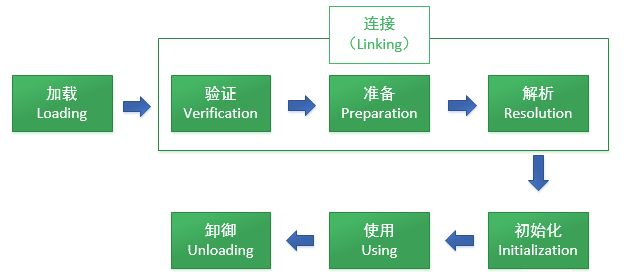
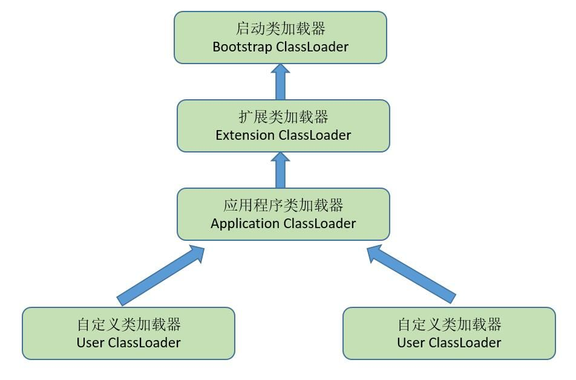

## 一、概述

虚拟机把描述类的数据从class文件加载到内存，并对数据进行验证、准备、解析和初始化，最终形成可以被虚拟机直接使用的Java类型，这就是虚拟机的类加载机制（**字节码文件-字节码对象**）

Java里天生可以动态扩展的语言特性就是依赖运行期动态加载和动态连接这个特点实现的

## 二、类加载的时机

**类的生命周期**



<!-- more -->

虚拟机规范中并没有强制约束什么时候开始类加载，由虚拟机实现自由把握，但对于初始化阶段，规定了5种特殊情况：

- 遇到new、getstatic、putstatic、invokestatic这4条字节码指令时
- 对类进行反射调用的时候
- 优先初始化父类
- 初始化执行的主类（main方法）
- JDK1.7动态语言支持，如果一个java.lang.invoke.MethodHandle实例最后的解析结果REF_getStatic、REF_putStatic、REF_invokeStatic的方法句柄，并且这个方法句柄对应的类没有进行初始化，触发初始化

这5种场景中的行为称为对一个类进行主动引用，除此之外，所有引用类的方式都不会触发初始化，称为被动引用

- 通过子类来引用父类的静态字段，只会触发父类的初始化
- 通过数组定义来引用类，不会触发此类的初始化
- 常量在编译阶段会存入调用类的常量池中，本质没有引用定义常量的类，不会触发初始化
- 一个接口在初始化时，并不要求其父接口全部完成初始化

## 三、类加载的过程

### 1、加载

加载是类加载过程第一个阶段，需要完成3件事情：

- 通过一个类的全限定名来获取定义此类的二进制字节流
- 将这个字节流所代表的静态存储结构转化为方法区的运行时数据结构
- 在内存中生成一个代表类的java.lang.Class对象，作为方法区这个类的各种数据的访问入口

开发人员可以通过定义自己的类加载器去控制字节流的获取方式（即重写一个类加载器的loadClass方法）

数组类本身不通过类加载器创建，由Java虚拟机直接创建，但数组类的元素类型最终是要靠类加载器去创建

- 数组是引用类型，将在加载该组件类型的类加载器的类名称空间上被标识
- 数组不是引用类型，将会把数组标记为与启动类加载器关联
- 数组类可见性与组件类型可见性一致，如果组件类型不是引用类型，默认为public

### 2、验证

验证是连接阶段的第一步，这一阶段的目的是为了确保class文件的字节流中包含的信息符合当前虚拟机的要求，并且不会危害虚拟机自身的安全

**0、产生危害原因**

Class文件并不一定由Java源码编译而来，可以使用任何途径产生，甚至包括用16进制编辑器直接编写来产生Class文件

**1、文件格式验证**

验证**字节流**是否符合Class文件格式的规范，并且能被当前版本虚拟机处理

- 主、次版本号是否在当前虚拟机处理范围之内
- 常量池的常量中是否有不被支持的常量类型（检查tag标志）

通过这个阶段的验证，**字节流**才会进入内存的方法区中进行存储，后面3个验证阶段全部基于**方法区**的存储结构进行的，不会再直接操作字节流

**2、元数据验证**

对字节码描述的信息进行**语义分析**，以保证其描述的信息符合Java语言规范的要求

- 是否有父类（除java.lang.Object外，都应有父类）
- 是否继承不允许被继承的类（final类）
- 字段、方法是否与父类产生矛盾（final字段、final方法）

这个阶段的主要目的是对类的**元数据**信息进行语义校验，保证不存在不符合Java语言规范的元数据信息

**3、字节码验证**

对类的**方法体**进行校验分析，保证被校验类的方法在运行时不会做出危害虚拟机安全的事件

- 保证任意时刻操作数栈的数据类型与指令代码序列都能配合工作
- 保证方法体中的类型转换是有效的

在JDK1.6之后的Javac编译器和Java虚拟机中进行一项优化，给方法体中Code属性的属性表增加了一项名为**StackMapTable**的属性，描述了方法体所有基本块开始时**本地变量表和操作数栈**应有的状态，在字节码验证期间，就不需要根据程序推导这些状态的合法性，只需要检查StackMapTable属性中的记录是否合法即可，将字节码验证的类型推导转变为类型检查，从而节省一些时间。（编译时生成，不需推导，只需检查）

理论上，StackMapTable存在错误或被篡改骗过虚拟机类型校验的可能，也是一个值得思考的问题

**4、符号引用验证**

对类自身以外（**常量池**中的各种符号引用）的信息进行匹配性校验

- 通过字符串描述的全限定名是否能找到对应的**类**
- 类中是否存在符合方法的字段描述符以及简单名称所描述的**方法**和**字段**
- 类、字段、方法的**访问性**

验证阶段是一个非常重要的、但不是一个必要的阶段，在实施阶段就可以考虑使用**-Xverify:none**参数来关闭大部分的类验证措施，缩短虚拟机类加载的时间

### 3、准备

正式为**类变量**分配内存并设置类变量初始值的阶段，所使用的内存都将在**方法区**中进行分配

进行内存分配的仅包括类变量（被static修饰的变量），而不包括实例变量，实例变量将在对象实例化时随对象一起分配在堆中。

```java
public static int value=123;
```

准备阶段过后value值为0，而把value赋值为123的putstatic指令是程序被编译后，存放于类构造器<clinit>方法之中，将在初始化阶段才会执行

```java
public static final int value=123;
```

通常情况下初始值是零值，相对一些特殊情况，编译时Javac将会为value生成ConstantValue属性，在准备阶段虚拟机就会根据ConstantValue的设置将value赋值为123（**参考类文件结构一节进行了解**）

### 4、解析

将常量池内的符号引用替换为直接引用

- 符号引用：以一组符号来描述所引用的目标（CONSTANT_Class_info）
- 直接引用：直接指向目标的指针、相对偏移量或间接定位到目标的句柄

**1、类或接口的解析**

- 非数组
- 数组
- 访问权限验证

**2、字段解析**

- 类本身
- 父类
- 接口
- 访问权限验证

**3、类方法解析**

- 接口判定
- 类本身
- 父类
- 接口
- 访问权限验证

**4、接口方法解析**

- 类判定
- 接口本身
- 父接口

### 5、初始化

类初始化阶段是类加载过程最后一步，在系统阶段变量已经赋过一次系统要求的初始值，而在初始化阶段，则根据程序员制定的主观计划去初始化类变量和其他资源，初始化阶段是执行类构造器<clinit>方法的过程

<clinit>方法是由编译器自动收集类中的所有类变量的赋值动作和静态语句块中的语句合并产生的，编译器收集的顺序按照语句在源文件中出现的顺序

```java
public class ClinitTest {
    static class Parent{
        public static int A=1;
        static {
            A=2;
        }
        //public static int A=1;
    }

    static class Sub extends Parent{
        public static int B=A;
    }

    public static void main(String[] args){
        System.out.println(Sub.B);
    }
}
```

如果多个线程同时去初始化一个类，那么只会有一个线程去执行这个类的<clinit>方法，其他线程都需要阻塞等待，直到活动线程执行<clinit>方法完毕

## 四、类加载器

### 0、简介

通过一个类的全限定名来获取描述此类的二进制字节流这个动作放到Java虚拟机外部去实现

### 1、类与类加载器

对于任意一个类，都需要由加载它的类加载器和这个类本身一同确立其在Java虚拟机中的唯一性，每一个类加载器，都拥有一个独立的类名称空间。

```java
public class ClassLoaderTest {
    public static void main(String[] args) throws Exception{
        ClassLoader myClassLoader=new ClassLoader() {
            @Override
            public Class<?> loadClass(String name) throws ClassNotFoundException {
                try {
                    String fileName=name.substring(name.lastIndexOf(".")+1)+".class";
                    InputStream is = getClass().getResourceAsStream(fileName);
                    if(is==null){
                        return super.loadClass(name);
                    }
                    byte[] b=new byte[is.available()];
                    is.read(b);
                    return defineClass(name,b,0,b.length);
                }catch (IOException e){
                    throw new ClassNotFoundException(name);
                }
            }
        };
        Object obj=myClassLoader.loadClass("classloader.ClassLoaderTest").newInstance();
        System.out.println(obj.getClass());
        System.out.println(obj instanceof classloader.ClassLoaderTest );
    }
}
```

```java
class classloader.ClassLoaderTest
false
```

只要加载的类加载器不同，那两个类就必定不相同（一个系统应用程序类加载器、一个自定义类加载器）

### 2、双亲委派模型

**定义**

双亲委派模型要求除了顶层的启动类加载器外，其余的类加载器都应当有自己的父类加载器

- **启动类加载器**：负责将**<JAVA_HOME>\jre\lib**目录中的类库加载到虚拟机内存
- **扩展类加载器**：负责加载**<JAVA_HOME>\jre\lib\ext**目录中的类库
- **应用程序类加载器**：负责加载用户类路径上**（ClassPath）**指定的类库



**原理**

如果一个类加载器收到类加载的请求，它首先不会自己去尝试加载这个类，而是把这个请求委派给父类加载器完成。每个类加载器都是如此，只有当父加载器在自己的搜索范围内找不到指定的类时，子加载器才会尝试自己去加载。 （父先子后）

**好处**

同一个类被各种类加载器加载后都是同一个类

**实现**

```java
protected Class<?> loadClass(String name, boolean resolve)
    throws ClassNotFoundException
    {
        synchronized (getClassLoadingLock(name)) {
            // 首先，检查类是否已经被加载过
            Class<?> c = findLoadedClass(name);
            //没被加载过，执行加载过程
            if (c == null) {
                long t0 = System.nanoTime();
                try {
                	//如果父加载器不为空，调用父类loadclass方法
                    if (parent != null) {
                        c = parent.loadClass(name, false);
                    } else {
                    	//父加载器为空，默认使用启动类加载器作为父加载器
                        c = findBootstrapClassOrNull(name);
                    }
                } catch (ClassNotFoundException e) {
                    //父类加载器无法完成加载，抛出异常
                }
				//调用自身findClass方法进行类加载
                if (c == null) {
                    long t1 = System.nanoTime();
                    c = findClass(name);
                    // this is the defining class loader; record the stats
                    sun.misc.PerfCounter.getParentDelegationTime().addTime(t1 - t0);
                    sun.misc.PerfCounter.getFindClassTime().addElapsedTimeFrom(t1);
                    sun.misc.PerfCounter.getFindClasses().increment();
                }
            }
            //被加载过，根据传入参数判定是否需要分解
            if (resolve) {
                resolveClass(c);
            }
            //返回class对象
            return c;
        }
    }
```

### 3、破坏双亲委派模型

受到加载范围的限制，父类加载器无法加载到需要的文件，需要委托子类加载器去加载class文件，如JDBC

##  扩展阅读

- [自定义类加载器](https://www.cnblogs.com/wxd0108/p/6681618.html)

- [双亲委派与破坏](https://www.cnblogs.com/joemsu/p/9310226.html#_caption_2)


